# Learn to Pi - Shopping List

The first thing you'll have to do is get everything you need together. We've made a brief shopping list to help you figure out what you need, and included some links for good quality, reasonably priced options.

Whenever possible! Please try to buy this from Adafruit. They developed all the IP behind Raspberry Pi, and are a great organization to support!

###   **Hardware**

1. Raspberry Pi 3 Model B+&nbsp; • &nbsp; <ins>[Raspberry Pi 3 - Model B+ - 1.4GHz Cortex-A53 with 1GB RAM](https://www.adafruit.com/product/3775)</ins>&nbsp; • &nbsp;[ [Adafruit](https://www.adafruit.com/) ]
> Note that the latest version is the Raspberry Pi 4. This upgrade looks great! But they're still working some of the bugs out, so we're not going to use it just yet.
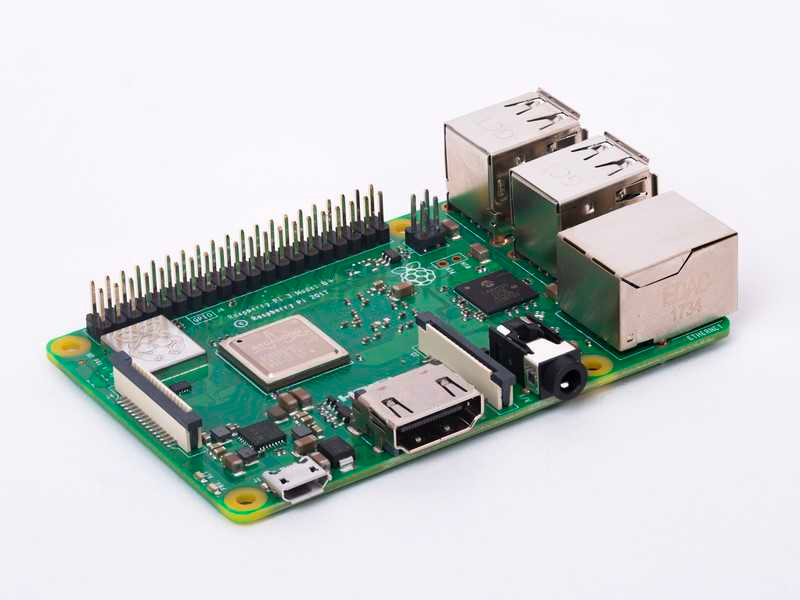

2. MicroSD Card. &nbsp; • &nbsp; <ins>[SanDisk Extreme Pro](https://www.amazon.com/dp/B06XYHN68L/ref=cm_sw_em_r_mt_dp_U_WBkwDbG26G3PN)</ins>&nbsp; • &nbsp;[ [Amazon](https://www.amazon.com/dp/B06XYHN68L/ref=cm_sw_em_r_mt_dp_U_WBkwDbG26G3PN) ]
> The MicroSD card works for your Raspberry Pi in the same way that a hard drive does for your computer. They are priced differently mainly based on size, rather than speed. Since you don't need a lot of storage, we recommend buying a fast card (Class 10, U3) and between 8GB to 32GB.
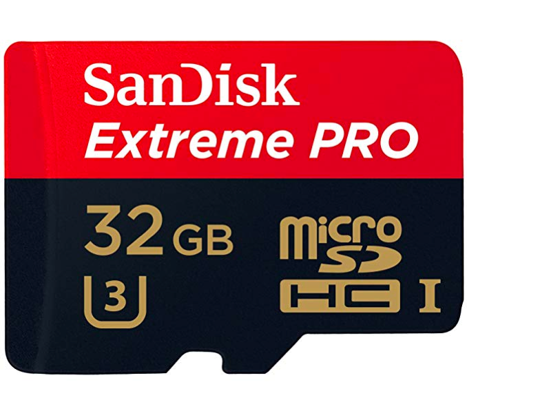

3. Micro-USB Power Supply &nbsp; • &nbsp;<ins>[5V 2.5A Switching Power Supply with 20AWG MicroUSB Cable](https://www.adafruit.com/product/1995)</ins>&nbsp; • &nbsp; [ [Adafruit](https://www.adafruit.com/) ]
> You need a power supply that can run 5 volts at 2 amps, so look for one that says 5V @ 2A. 
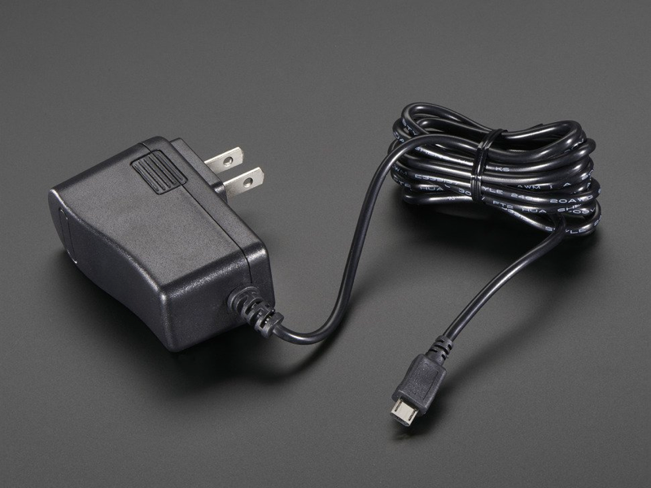

4. Ethernet Patch Cable (Cat7)&nbsp; • &nbsp; <ins>[ CAT7 Flat Ethernet Cable Shielded RJ45](https://www.amazon.com/dp/B06XY1KH9W/ref=cm_sw_em_r_mt_dp_U_HkXwDb06PJS8B)</ins>&nbsp; • &nbsp;[ [Amazon](https://www.amazon.com/dp/B06XY1KH9W/ref=cm_sw_em_r_mt_dp_U_HkXwDb06PJS8B) ] 
> Some of these projects need to be plugged directly in to your router. You can probably get away with any old cable, but if possible get one that's at least Category7 (Cat 7). These provide a faster, more reliable connection.
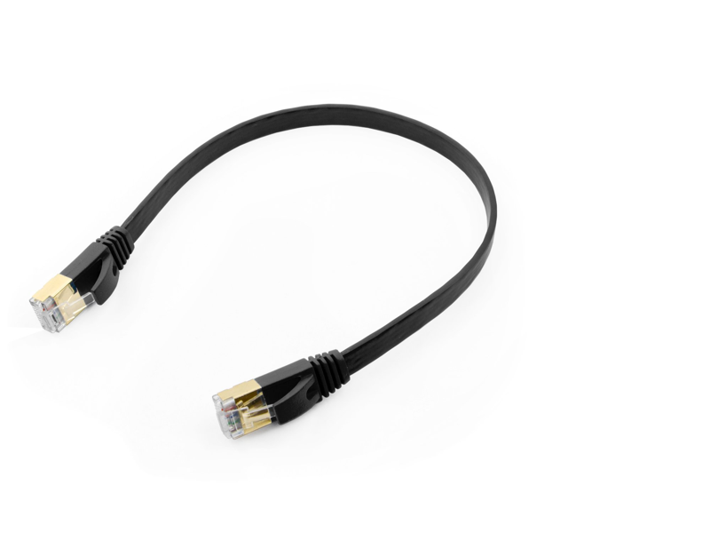

5. Micro-SD Card Reader/Writer&nbsp; • &nbsp; <ins>[USB 3.0 Dual Slot Flash Memory Card Reader](https://www.amazon.com/dp/B01EFPX9XA/ref=cm_sw_em_r_mt_dp_U_joXwDb4HDCB64)</ins>&nbsp; • &nbsp;[ [Amazon](https://www.amazon.com/dp/B01EFPX9XA/ref=cm_sw_em_r_mt_dp_U_joXwDb4HDCB64) ] 
> You'll need to write the Raspian operating system to the SD card to get started. It's worth getting one that's reasonable fast too.

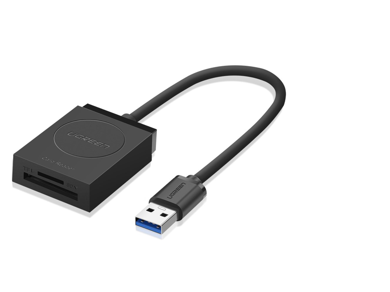

###   **Optional**

1. Raspberry Pi Kit&nbsp; • &nbsp; <ins>[CanaKit Raspberry Pi 3 B+ (B Plus) with Premium Clear Case and 2.5A Power Supply](https://www.amazon.com/dp/B07BC7BMHY/ref=cm_sw_em_r_mt_dp_U_yvXwDbQHNPTE4)</ins>&nbsp; • &nbsp;[ [Amazon](https://www.amazon.com/dp/B07BC7BMHY/ref=cm_sw_em_r_mt_dp_U_yvXwDbQHNPTE4) ] 
> You can get lots of the above items in a package, such as this one from CannaKit. This comes with your Raspberry Pi 3 B+, power supply, case, and a few other items.
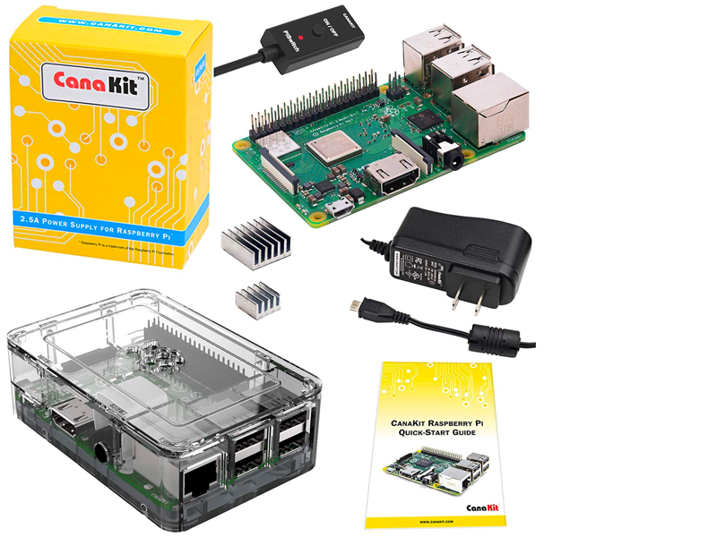

2. Case&nbsp; • &nbsp; <ins>[Raspberry Pi 3 Case - Black/Grey](https://www.amazon.com/dp/B01F1PSFY6/ref=cm_sw_em_r_mt_dp_U_fyXwDbSTP5RY4)</ins>&nbsp; • &nbsp;[ [Amazon](https://www.amazon.com/dp/B01F1PSFY6/ref=cm_sw_em_r_mt_dp_U_fyXwDbSTP5RY4) ] 
> This is a good simple case to keep your Raspberry Pi protected
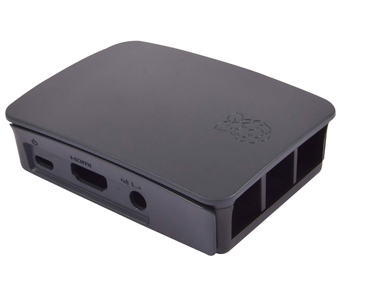

3. U2F Security Key&nbsp; • &nbsp;<ins>[HyperFIDO U2F USB Security Key](https://www.hypersecu.com/products/hyperfido)</ins>&nbsp; • &nbsp;[ [Amazon](https://www.amazon.com/dp/B07HKP5J4L/ref=cm_sw_em_r_mt_dp_U_jCkwDbG69MDRV) ]
>For our section on Cybersecurity, we recommend you pick one of these up. You'll find them to be one of the most useful devices, that saves you time.
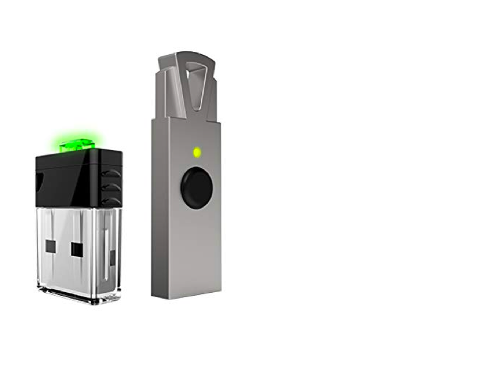

###   **Software**

5. Balena Etcher&nbsp; • &nbsp;<ins>[Balena](https://www.balena.io/etcher/)</ins>
>You're going to need to use this to burn the Raspian OS to your microSD card.

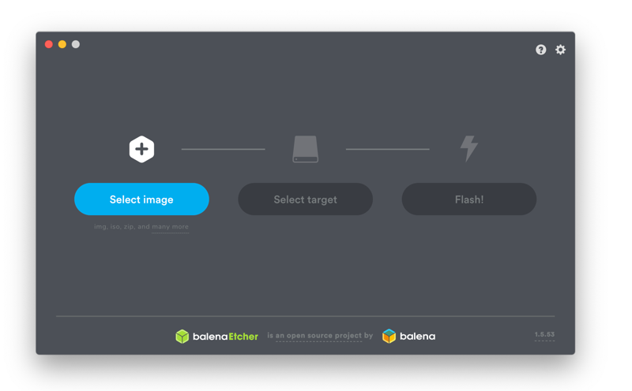

6. RaspianOS&nbsp; • &nbsp;<ins>[RaspberryPi.org](https://www.raspberrypi.org/downloads/raspbian/)</ins>
>Download the latest version (as of August 19th, 2019) is called BUSTER. Get the one with desktop and recommended software to start.

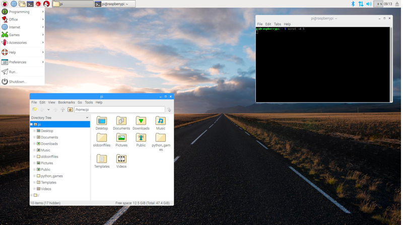

7. Sublime Text 3&nbsp; • &nbsp;<ins>[Sublime Text](https://www.sublimetext.com/3)</ins>
>This is a text editor used specifically for programming. It's highly recommended that you use this one, but there are other similar ones around. Don't use the text editor that came with your computer, it sometimes adds extra characters that make files unusable.

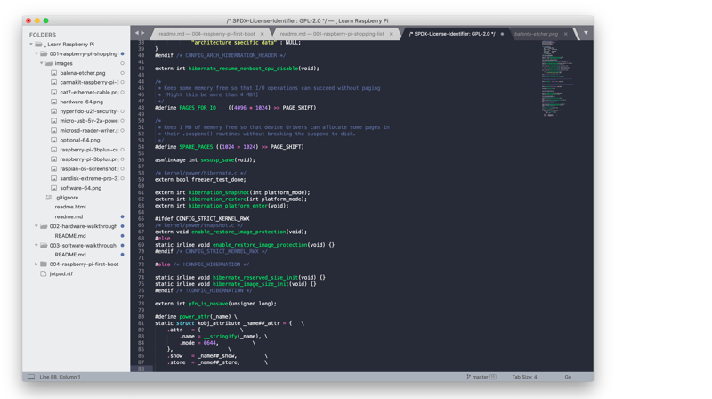

8. Github Desktop&nbsp; • &nbsp;<ins>[GitHub Desktop](https://desktop.github.com)</ins>
>Lots of people like to use Git through the command line. To make things easy to follow along with, we're going to use the desktop version.

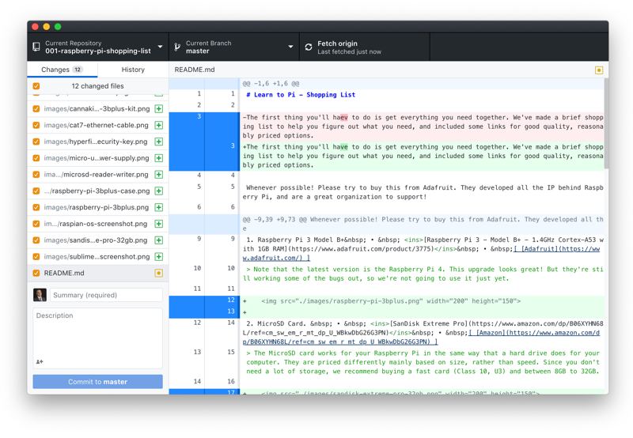

9. LanScan&nbsp; • &nbsp;<ins>[Iwaxx](https://www.iwaxx.com/lanscan/)</ins>
>This app will help you see what devices are currently connected to your network, and their IP Addresses.

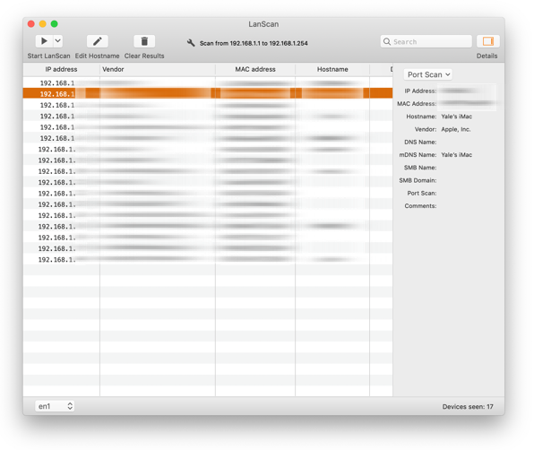

