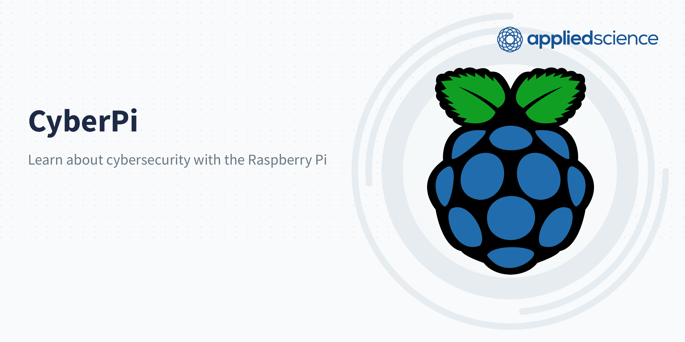

# Learn to Pi - Shopping List
Here is a list of hardware that you need to order to follow along with the tutorial, as well as any software that you may need. We try to use open source as much as possible.

## 🖥️ Hardware
Here is a list of hardware you will need to have on hand, as well as links to where you can buy it.  
All of these links are for the most basic, entry level equipment.

1. [Raspberry Pi 4](https://www.adafruit.com/product/4296) or [Raspberry Pi 3 B+](https://www.amazon.com/ELEMENT-Element14-Raspberry-Pi-Motherboard/dp/B07P4LSDYV)
This is the SBC (single board computer) that we are using for this project. Note that this tutorial was written for the Raspberry Pi 3B+, but it also works with the Raspberry Pi 4.

2. [32GB MicroSD Card](https://www.amazon.com/dp/B06XYHN68L/ref=cm_sw_em_r_mt_dp_U_WBkwDbG26G3PN)   
The MicroSD card works for your Raspberry Pi in the same way that a hard drive does for your computer. They are priced differently mainly based on size, rather than speed. Since you don't need a lot of storage, we recommend buying a fast card (Class 10, U3) and between 8GB to 32GB.

3. [USB-C Power Adapter](https://www.adafruit.com/product/4298)  
You need a power supply that can run 5 volts at 2 amps, so look for one that says 5V @ 2A. 

4. [Ethernet Patch Cable](https://www.amazon.com/dp/B06XY1KH9W/ref=cm_sw_em_r_mt_dp_U_HkXwDb06PJS8B)  
Some of these projects need to be plugged directly in to your router. You can probably get away with any old cable, but if possible get one that's at least Category7 (Cat 7). These provide a faster, more reliable connection.

5. [Micro-SD card Reader/Writer](https://www.amazon.com/Celnex-MicroSD-MicreSD-MicroSDHC-MicroSDXC/dp/B092HSLL9R/ref=sr_1_3?crid=3O945YZZ1RONE&keywords=micro-SD+reader+writer&qid=1679152744&s=electronics&sprefix=micro-sd+reader+writer%2Celectronics%2C72&sr=1-3)  
You'll need to write the Raspian operating system to the SD card to get started. 

6. [3.5" Touchscreen + Case](https://www.amazon.com/Celnex-MicroSD-MicreSD-MicroSDHC-MicroSDXC/dp/B092HSLL9R/ref=sr_1_3?crid=3O945YZZ1RONE&keywords=micro-SD+reader+writer&qid=1679152744&s=electronics&sprefix=micro-sd+reader+writer%2Celectronics%2C72&sr=1-3)  
You will want to have a compatible 3.5" LCD touchscreen as well as a protective cavse

## 💾 Software

1. [Raspberry Pi Imager](https://www.raspberrypi.com/software/)  
This is the software that will be used to write to your SD cards. It will also present you with various different operating systems that you can experiment with.

2. [Sublime Text 4](https://www.raspberrypi.com/software/)  
Or you can use any other text editor such as [VS Code](https://code.visualstudio.com/).

3. [Github Desktop](https://desktop.github.com/)  
This is a GUI (graphical user interface) if you want to use git but are still getting used to the command line. 

4. [LanScan](https://www.iwaxx.com/lanscan/)  
This is a free version of an app that will help you see what devices are connected to your network.

