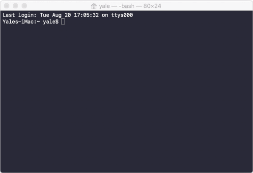

Tools:

# OSX Software

## Terminal for Mac
>The terminal is the backend of the operating system that lets you run commands. When you hear of computers getting "hacked" it us

### Most common commands
    show command, argument, syntax
    show the main commands
    show a few with arguments
    show man / help

### Adding plugins & themes
>We're going to add a plugin called bash-it to terminal. You can find out more about what it does here: https://github.com/Bash-it/bash-it

    It comes with some nice plugins and lets you add some great themes. 

1. Clone the repo to your computer.
>git clone --depth=1 ht<span>tps://github.com/Bash-it/bash-it.git ~/.bash_it 

2. Run the installation file
>Run ~/.bash_it/install.sh (it automatically backs up your current terminal bash file)

3. Pick a theme you like from here: https://github.com/Bash-it/bash-it/wiki/Themes 
>I like "Powerline Plain"

4. Modify your bash-it config file by typing: 
	`sudo nano ~/.bash_profile`  

	- Scroll down to where it says 
	`BASH_IT_THEME='bobby'` and change it to `BASH_IT_THEME='powerline-plain'` (or whatever theme you like)

5. Press Option+X and select `Yes` to save and exit



## Sublime Text 3

### Adding Plugins
One of the most amazing parts of Sublime, is how you can add plugins using "Package Manager".

### Installing Package Manager
>Package Manager is a plugin for Sublime that lets you add, remove and modify plugins.

1. First go to [Package Control's website](https://packagecontrol.io/installation)

2. in Sublime click View > Show Console

3. Paste the code from Package Control (also below) into console and press Enter

```
import urllib.request,os,hashlib; h = '6f4c264a24d933ce70df5dedcf1dcaee' + 'ebe013ee18cced0ef93d5f746d80ef60'; pf = 'Package Control.sublime-package'; ipp = sublime.installed_packages_path(); urllib.request.install_opener( urllib.request.build_opener( urllib.request.ProxyHandler()) ); by = urllib.request.urlopen( 'http://packagecontrol.io/' + pf.replace(' ', '%20')).read(); dh = hashlib.sha256(by).hexdigest(); print('Error validating download (got %s instead of %s), please try manual install' % (dh, h)) if dh != h else open(os.path.join( ipp, pf), 'wb' ).write(by)
```

<gif downloaded>

You won't notice any changes, but package manager has been installed succesfully.

# Install Dracula
> This is just a simple color scheme that we're going to install for our first package.

1. Bring up Package control by pressing `Command + Shift + P`

2. Type `Install Package`

3. Search for `Dracula Color Scheme` and press enter

4. Go to Sublime Text > Preferences > Color Scheme >
	Select `Dracula`

# Install 'Markdown Preview'
> This lets you preview and write in markdown, which is a very easy and useful format to know.
> This is [Markdown Preview](https://packagecontrol.io/packages/MarkdownPreview) and [here](https://facelessuser.github.io/MarkdownPreview/)

1. Bring up Package control by pressing `Command + Shift + P`

2. Type in `Package Control: Install Package`

3. Search for `MarkdownPreview` and press `enter`

5. Restart Sublime

6. Let's set up Safari as our default browser (OSX Catalina #known issue)

    Sublime Text > Preferences > Package Settings > Markdown Preview > Settings

```
{
// "browser": "/Applications/Safari.app", <-- needed for catalina
"parser": "github", 
}
```
                *** at some point will have to add Github Key


6. Set up your key bindings
> These are the keys you press to render a preview of your markdown HTML

    `{"keys": ["command+shift+m"], "command": "markdown_preview", "args": {"target": "browser", "parser":"markdown"},}`

# Install 'MarkdownEditing'

1. Bring up Package control by pressing `Command + Shift + P`

2. Type `Install Package`

3. Sublime Text > Preferences > Package Settings > Markdown Editing > Markdown GFM Settings > User.
>Add this to the file below

```
{
    "color_scheme": "Packages/Dracula Color Scheme/Dracula.tmTheme",

// turn on word wrap for source and text
// default value is "auto", which means off for source and on for text
    
    "word_wrap": true,

// set word wrapping at this column
// default value is 0, meaning wrapping occurs at window width

    "wrap_width": 126
    
}
```
4. In the bottom right change it to Markdown GFM


****

- Github + Desktop
- Github commands

- LanScan
