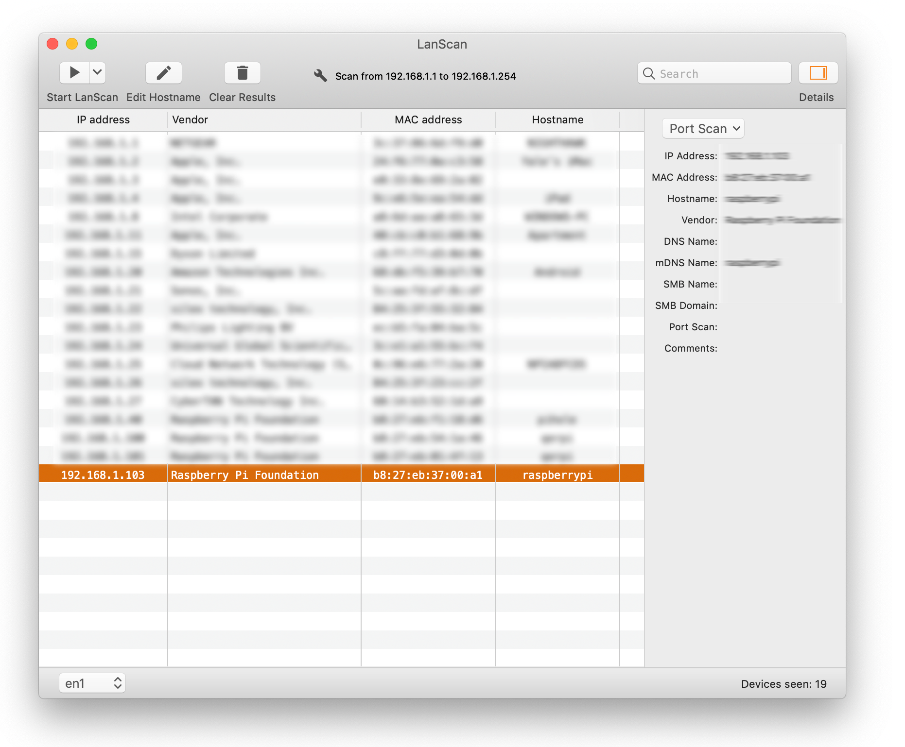
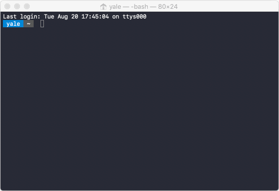
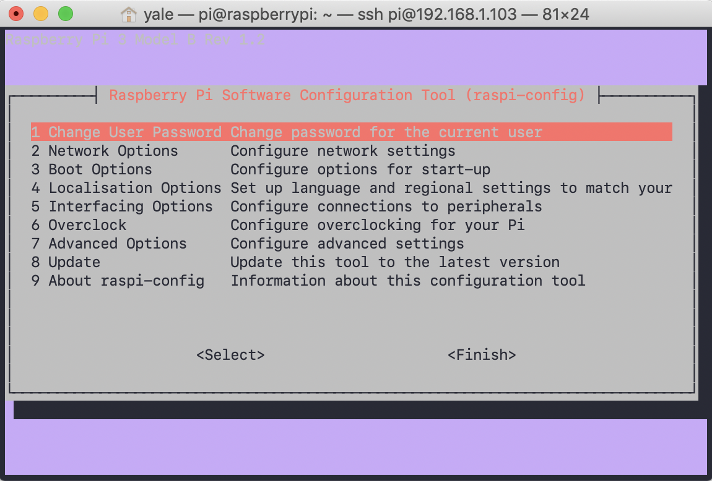
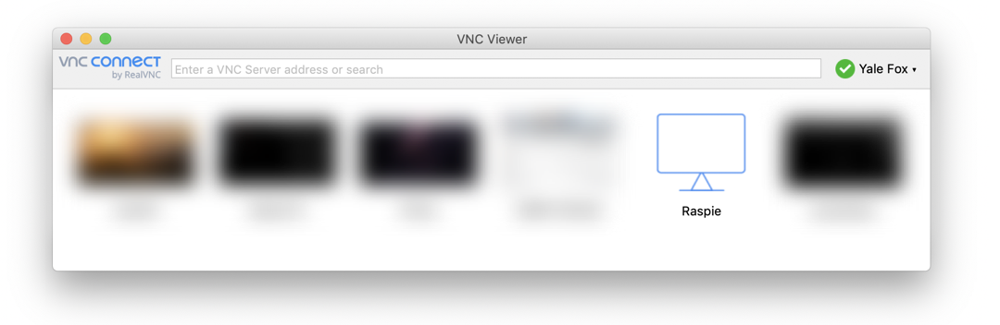

# 004 - Raspberry Pi First Boot (Headless)


In this tutorial, we will be setting up a Raspberry Pi in a "headless" configuration, which means that you won't need to connect it to a monitor, mouse, or keyboard. Instead, we'll be using two network protocols: SSH and VNC, for securely transmitting text and video information, respectively.

## Installing Raspian for the first time 

1. Flash your Raspberry Pi using the official [Raspberry Pi Burner](https://www.raspberrypi.com/software/)
2. To enable SSH, create a blank file named ssh in the root directory of the burned card.
3. Create a file named wpa_supplicant.conf and paste the following text into it, updating it with your real Wi-Fi information:

```text
# Set the country code to US for wireless regulations
country=US

# Set the directory where the wpa_supplicant control interface will be created 
# and set the group ownership to netdev
ctrl_interface=DIR=/var/run/wpa_supplicant GROUP=netdev

# Allow wpa_supplicant to modify the configuration file
update_config=1

# Configure a network block for a wireless network with the given SSID and PSK
network={
    ssid="your_internet"   # Replace "your_internet" with the actual SSID of your wireless network
    psk="your_password"    # Replace "your_password" with the actual pre-shared key (password) of your wireless network
}
```

4. Safely eject the microSD card and insert it into your Raspberry Pi
5. Connect the Raspberry Pi to the power source and wait a few minutes for it to fully boot up.
6. Determine the Raspberry Pi's IP address by using a tool like [LanScan Free](https://www.iwaxx.com/lanscan/) and look for a device with the hostname `raspberrypi`. Write down the IP address.

  

7. In Terminal on your Mac, enter ssh pi@[IP_ADDRESS], replacing [IP_ADDRESS] with the IP address of your Raspberry Pi. The default username is pi and the password is raspberry.
8. In Terminal, type `sudo raspi-config` to open the Raspberry Pi Configuration Program with administrative privileges.

## Configuring Raspberry Pi for the first time
If the Pi is booting succesfully, then that means it's time to configure!

  

9. After you have logged in to the raspberry pi using SSH, type `raspi-config` and you should see something that looks like this:  

  

10. There are a number of screens that we encourage you to explore, however there are only a few that we are concerned with for our first boot.Use the `up`, `down`, and `enter` keys here to navigate


## Raspberry Pi First Boot (Headless)
1. Change User Password
    - Select "Change User Password" from the main menu. 
    - The current password is `raspberry`. Type a new password that you will remember, and then type it again when prompted. 

2. Boot Options
    - Select "Boot Options" from the main menu.
    - Select **B1: Desktop / CLI** and then choose **B4: Desktop Autologin** from the next menu.

3. Interfacing Options
    - Select "Interfacing Options" from the main menu. 
    - Select **VNC** and then select **Yes** to turn it on.
    - *Note: SSH is already turned on by default.*

4. Advanced Options
    - Select "Advanced Options" from the main menu. 
    - Select **A1: Expand Filesystem** and then select **A5: Resolution DMT85**.

5. Finish
    - Select "Finish" from the main menu. 

6. Reboot
    - Select "Yes" to reboot the Raspberry Pi.


## Use VNC Viewer to connect to your Raspberry Pi
To connect to your Raspberry Pi using VNC:
    
1. Download and install VNC Viewer from [RealVNC](https://www.realvnc.com/en/connect/download/viewer/).
2. Open VNC Viewer, click File > New Connection, enter the IP address and name of your Pi, and press OK.
3. Enter the password and save it. You should see the following image:  

  

4. Double-click "Raspie", and you may see an error message regarding hosts. Enter your password and hit save.
5. Follow through the prompts, including pressing OK to the SSH warning, filling out your Country, Language, and Timezone, entering a new password, and clicking Next through the remaining steps. Make sure to skip adding Wi-Fi. When prompted to update software, click Next. This will download all the software and you can then click reboot.
    
## You're done!
Congratulations, you have successfully booted up a headless Raspberry Pi and logged in through VNC.
