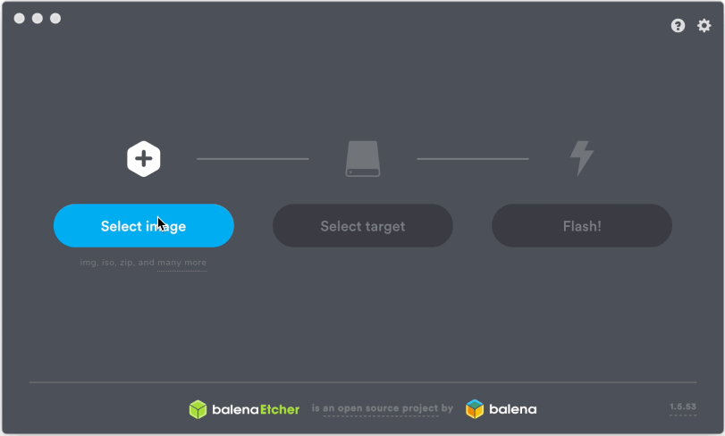

# 004 - Raspberry Pi First Boot


There's lots of different ways to get a Raspberry Pi up and running. We're going to do a 'headless' installation. That means you don't need to connect it to a monitor, mouse or keyboard. We'll be using two network protocols called `SSH` and `VLC` for this one. These are two different ways for sending information over the network.

- `Network Protocols` are special formats that computers understand to send and receive information.
- `SSH` is a way of securely transmitting text information
- `VLC` is a way that we can remotely connect via video

## Installing Raspian for your first time 

1. Download the latest OS image https://www.raspberrypi.org/downloads/raspbian/
    - Raspbian Buster with desktop and recommended software
    - Download the latest version

2. Using Etcher to Flash Raspian to your SD Card
    + Open Balena Etcher
    + Select the image from your download
    + Select the target microSD to flash
    + Press Flash



3. Enable SSH
    - Open sublime text and create a new file that is totally blank
    - Save it as "ssh" with no file extension
> This will enable Secure Socket Shell by default when you first boot up your Raspberry Pi

5. Create a new WiFi file which looks like this. Save it as "wpa_supplicant.conf"
``` 
country=US
ctrl_interface=DIR=/var/run/wpa_supplicant GROUP=netdev
update_config=1

network={
    ssid="your_internet"
    psk="your_password"
}
```

> Where it says SSID="your_interenet" you should enter in the exact spelling of your Wireless Network Name. Where it says PSK= "your_password" you should put your Wireless Password in. This will allow the Raspberry Pi to turn on and immediately connect to your network.

- `SSID` stands for Secure Set Identifier, but it's really just the name of your wireless network.
- `PSK` is your 'pre-shared key'. It's the password to your wireless.
- `.conf` is a configuraition file. ____

6. Open your microSD drive and place both those files in there. Then safely eject the disk.
>This will enable SSH and give it your wifi
>If you're still haveing problems, you can download the [sample files here](https://github.com/yalefox/004-raspberry-pi-first-boot/raw/master/files/additional_files.zip)

7. Slide the SD card in to your Raspberry Pi, and connect it to the power source. Wait a few minutes for it to fully boot up.

8. Figure out what your IP is.
>Open up LanScan and press "Start Scan"
>Look for something with the hostname "raspberrypi" and write down that IP. In this case it's 192.168.1.103


9. Open up Terminal on your mac and enter `ssh pi@192.168.1.103`
>SSH stands for Secure Socket Shell. It's one way that your computer can connect to another on the same network, using strong authentication and encryption.

`pi` is the username `@` tells SSH where the computer is and the IP is the address of the computer.

>After you enter it, it should ask you for a password. The default password for SSH on the Raspberry Pi is "raspberry". Type that in, press enter and you will be connected


9. In terminal, type `sudo raspi-config`
>That means open up the Raspberry Pi Configuration Program, with administrative privileges. This looks like this:


10. There are a number of screens here that we're going to go through, and we'll tell you what everything is useful for. Some aren't
> Use the `up`, `down`, and `enter` keys here to navigate

## Raspberry Pi Headless Configuration (fast)
1. Change User Password
    - The default password is `raspberry`. Change it to something different, that you won't forget.
2. Boot Options
    - **B1:** A
    - **B4:** A
3. Interfacing Options
    - **VNC** Turn ON 
    
    - *note: SSH is already turned on*
4. Advanced Options
    - A1 Expand Filesystem
    - A5 Resolution DMT85
5. Finish
6. Reboot

# Use VNC to connect
1. Download and Install [VNC Viewer](https://www.realvnc.com/en/connect/download/viewer/)
2. Open it up, and click
    - File > New Connection
    - Enter the IP address of your Pi
    - Enter the name of your Pi
    - Press OK
    - Enter the password, and save it


3. Double click Raspie
    - You will likely see the error message below (regarding hosts) the first time you connect.
    - Enter your password, and hit save.
    - Presto! You're in.

You should see this:


Follow through the prompts
- Press OK to the SSH warning. 
- Fill out your Country, Language, and Timezone then press Next.
- Enter your new password and click "next"
- Do you see a black border? If so check the box, otherwise click Next.
- You can skip adding Wi-Fi since you're already connected
- When you get to update software, press Next.
- It will download all the software, then you can click reboot.

## You're done!
Congratulations, you just booted up a headless raspberry pi and logged in through VNC.
