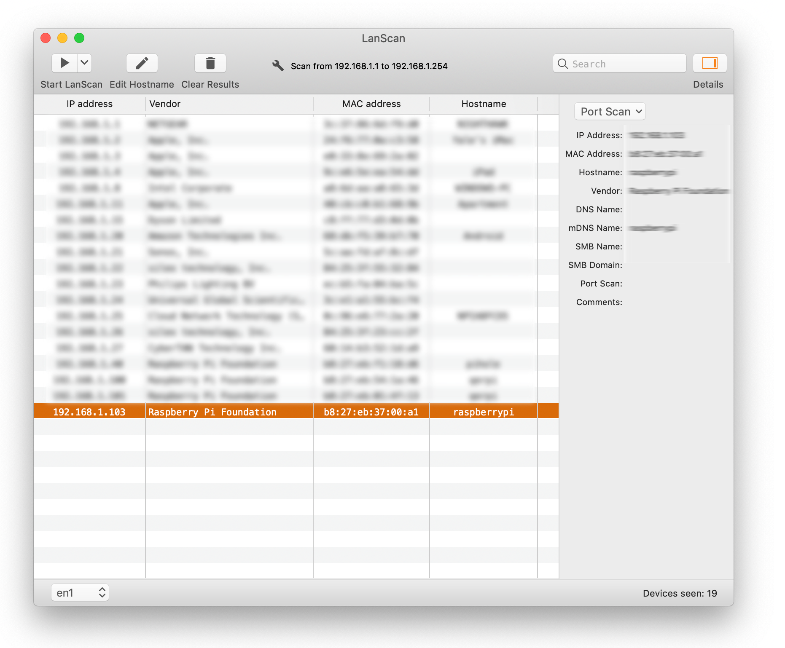
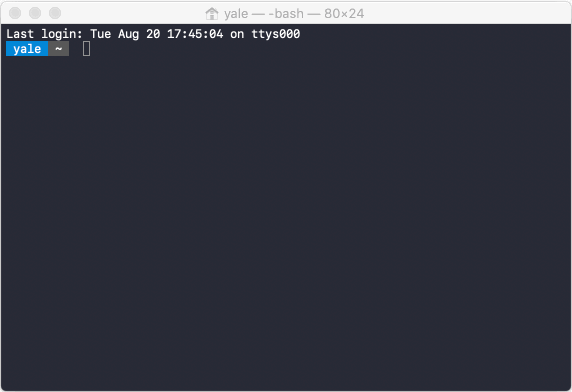
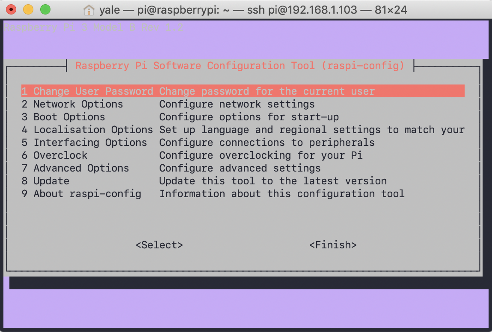
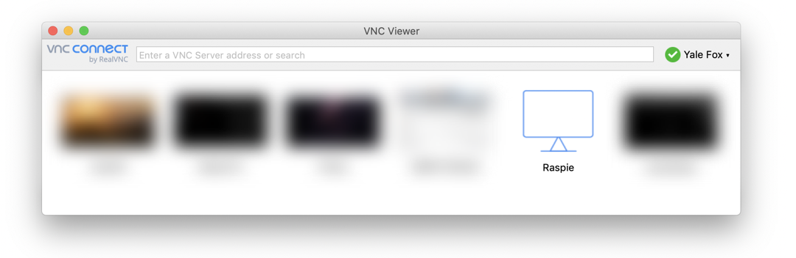
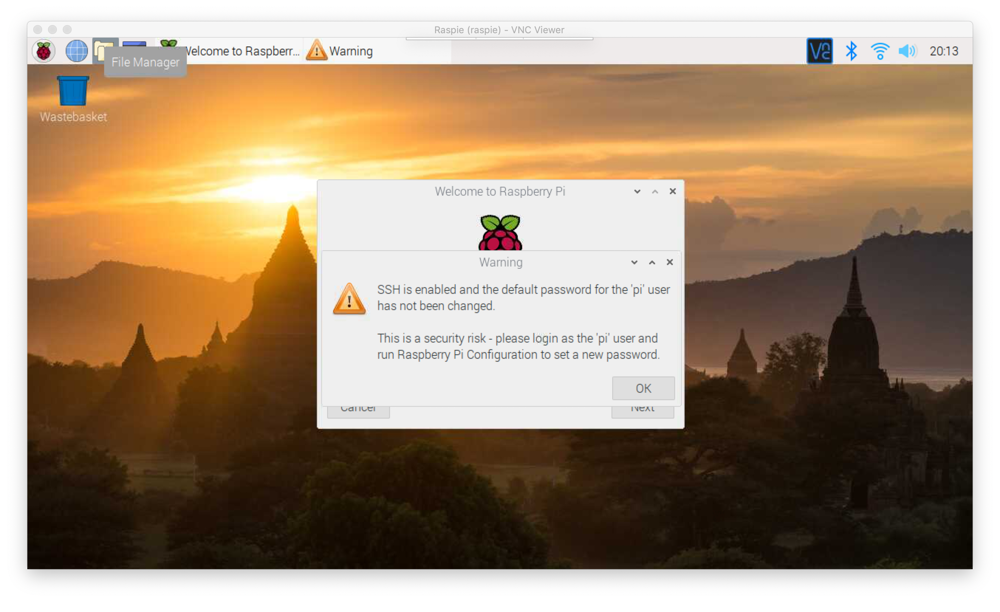

# 004 - Raspberry Pi First Boot (Headless)


There are many ways to get a Raspberry Pi up and running, but for this tutorial, we will be doing a 'headless' installation, which means you won't need to connect it to a monitor, mouse, or keyboard. Instead, we'll be using two network protocols: SSH and VNC. These are two different ways of sending information over the network.

- `Network Protocols` are special formats that computers understand to send and receive information.
- `SSH` is a way of securely transmitting text information
- `VLC` is a way that we can remotely connect via video

## Installing Raspian for your first time 

1. After you have flashed your Raspberry Pi using the official [Raspberry Pi Burner](https://www.raspberrypi.com/software/)
2. Enable SSH by creating a blank files named `ssh` in the **root** of your burned card.
3. Create a new file called `wpa_supplicant.conf` and then copy and paste the following text into it. Make sure to update it with your real wifi information first.

```text
# Set the country code to US for wireless regulations
country=US

# Set the directory where the wpa_supplicant control interface will be created 
# and set the group ownership to netdev
ctrl_interface=DIR=/var/run/wpa_supplicant GROUP=netdev

# Allow wpa_supplicant to modify the configuration file
update_config=1

# Configure a network block for a wireless network with the given SSID and PSK
network={
    ssid="your_internet"   # Replace "your_internet" with the actual SSID of your wireless network
    psk="your_password"    # Replace "your_password" with the actual pre-shared key (password) of your wireless network
}
```

4. Safely eject the microSD, and insert it into your raspberry pi.
5. Plug it in, and wait a few minutes (the first boot always takes longer)
6. Once we can see the Raspberry Pi on your network. Copy and paste the following command in the terminal, and `masscan` will help you determine what it's IP address is. Run the following command:

```
sudo masscan -p22 --rate=1000 192.168.1.0/24 --open-only | awk '/22\/tcp/{print $4}' | while read -r ip; do host "$ip"; done | awk '/has address/ {print $4, $NF}' || echo "No Raspberry Pi devices found on the network."
```


6. Open your microSD drive and place both those files in there. Then safely eject the disk.
>This will enable SSH and give it your wifi
>If you're still haveing problems, you can download the [sample files here](https://github.com/yalefox/004-raspberry-pi-first-boot/raw/master/files/additional_files.zip)

7. Slide the SD card in to your Raspberry Pi, and connect it to the power source. Wait a few minutes for it to fully boot up.

8. Figure out what your IP is.
>Open up LanScan and press "Start Scan"
>Look for something with the hostname "raspberrypi" and write down that IP. In this case it's 192.168.1.103



9. Open up Terminal on your mac and enter `ssh pi@192.168.1.103`
>SSH stands for Secure Socket Shell. It's one way that your computer can connect to another on the same network, using strong authentication and encryption.

`pi` is the username `@` tells SSH where the computer is and the IP is the address of the computer.

>After you enter it, it should ask you for a password. The default password for SSH on the Raspberry Pi is "raspberry". Type that in, press enter and you will be connected



9. In terminal, type `sudo raspi-config`
>That means open up the Raspberry Pi Configuration Program, with administrative privileges. This looks like this:



10. There are a number of screens here that we're going to go through, and we'll tell you what everything is useful for. Some aren't
> Use the `up`, `down`, and `enter` keys here to navigate

## Raspberry Pi Headless Configuration (fast)
1. Change User Password
    - The default password is `raspberry`. Change it to something different, that you won't forget.
2. Boot Options
    - **B1:** A
    - **B4:** A
3. Interfacing Options
    - **VNC** Turn ON 
    
    - *note: SSH is already turned on*
4. Advanced Options
    - A1 Expand Filesystem
    - A5 Resolution DMT85
5. Finish
6. Reboot

# Use VNC to connect
1. Download and Install [VNC Viewer](https://www.realvnc.com/en/connect/download/viewer/)
2. Open it up, and click
    - File > New Connection
    - Enter the IP address of your Pi
    - Enter the name of your Pi
    - Press OK
    - Enter the password, and save it



3. Double click Raspie
    - You will likely see the error message below (regarding hosts) the first time you connect.
    - Enter your password, and hit save.
    - Presto! You're in.

You should see this:



Follow through the prompts
- Press OK to the SSH warning. 
- Fill out your Country, Language, and Timezone then press Next.
- Enter your new password and click "next"
- Do you see a black border? If so check the box, otherwise click Next.
- You can skip adding Wi-Fi since you're already connected
- When you get to update software, press Next.
- It will download all the software, then you can click reboot.

## You're done!
Congratulations, you just booted up a headless raspberry pi and logged in through VNC.
