#  **QERPI: Secure Guest Wifi Access** 

## Shopping List
You'll need everything from the [getting started shopping list](https://github.com/yalefox/001-raspberry-pi-shopping-list) plus this:

- Raspberry Pi 3 B+ 3.5 inch Touch Screen with Case. <ins>[320x480 Pixel Monitor TFT LCD Game Display ](https://www.amazon.com/dp/B07N38B86S/ref=cm_sw_em_r_mt_dp_U_x8SxDbVWQN1ZP)</ins>&nbsp; • &nbsp;[ [Amazon](https://www.amazon.com/dp/B07N38B86S/ref=cm_sw_em_r_mt_dp_U_x8SxDbVWQN1ZP) ]
> _There are lots of different screens available, but this one works really well and comes with the right kind of case that we need._
> 
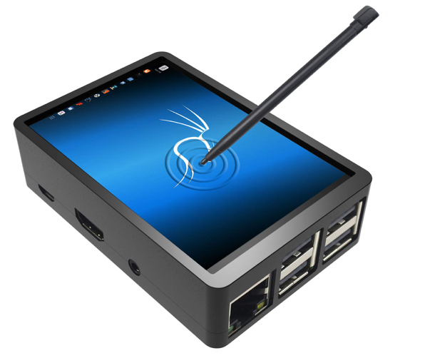

## Compatibility

    Raspberry Pi 3 model B:         [ Works! ]
    Raspberry Pi 3 model B+:        [ Works! ]
    Raspberry Pi 4 (4gb model):     [ Works! ]

## Languages used

    Operating System:       RaspianOS (Debian Linux)  
    Programming Language:   Python 3.7.4, jQuery 3.1.1, HTML, CSS

## Skills learned 
- [x] Installing Raspian 
- [x] Installing an LCD Screen
- [x] Cloning a github repository
- [x] Using apt and pip3 package managers 
- [x] Learning what system dependencies are
- [x] Changing file permissions
- [x] Learning what nano is and how to use it
- [x] Creating a shell script
- [x] Editing the autostart file
- [x] Add webserver and easy URL
- [x] Generating QR codes 
- [x] Generate a random password from a dictionary file

## To do
- [ ] Add security module
- [ ] Create an Alexa skill (screen)
- [ ] Create an Alexa skill, autojoin wifi
- [ ] Make it work in coffee shops (no data required) + everyone gets a secure vpn?

### Getting stated with QERPI
1. Follow the [Raspberry Pi first boot tutorial](https://github.com/yalefox/004-raspberry-pi-first-boot).    
2. Install the touchscreen. Make sure you line up the pins on the `GPIO` perfectly, or you may damage it.
3. Open up terminal and enter `sudo raspi-config` to bring up the configuration panel.
4. Scroll down to `Interface Options` and enable `SPI`. 
5. Reboot.

    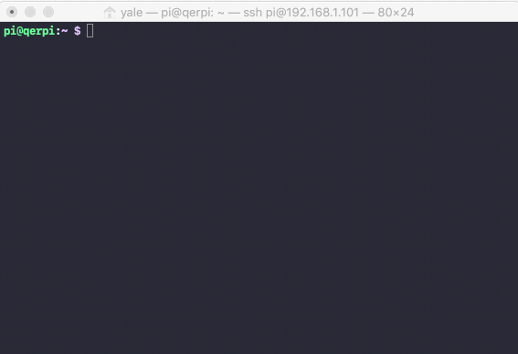

### Installing the LCD Touchscreen ###
>The Raspberry Pi operating system won't automatically know how to communicate with the touchscreen. In order to do so, we need to install drivers first.

Open terminal and type the following commands:

1. `sudo rm -rf LCD-show`  
>   **sudo** (super-user do) **rm** (remove file or directory) **-rf** (recursive, force) **LCD-Show** (name of the directory)  
> If you already have a directory called "LCD-Show" it will need to be deleted before we can download the new files. This command deletes the directory and all files and folders within it. 

2. `git clone https://github.com/goodtft/LCD-show.git`  
> **git** (popular version control program) **clone** (program within git to copy remote files)   
> **https://github.com/goodtft/LCD-show.git** (address of remote files for LCD drivers).
 
3. `chmod -R 755 LCD-show`
> **chmod** (system command to change the file permissions) **-R** (recursively) **755** (create full access permissions for all users) **LCD-show** (the location of the directory or files to change permissions for). 
 
> Some files are not accessible to all users. For example, important system files are only accessible by administrators, so a user does not accidentally break something.

4.  `cd LCD-show/` 
> **cd** (change directory) **LCD-Show** (directory to change to).

5. `sudo ./LCD35-show`
> **sudo** (super-user do) **./LCD35-show** the file name to execute
> Now that we have changed the permissions, we can execute the LCD35-show program.
   
The Raspberry Pi will automatically reboot, and when it does the LCD touchscreen should work.
> If the screen works, but touch feels strange, make sure you went into 'raspi-config' and enabled SPI. 

You may need to rotate the screen by typing:

6. `sudo ./rotate.sh 180` (or 90 or 270)
> **sudo** (super-user do) **rotate.sh** execute the rotate program **180** argument for amount of degrees to rotate.

You may want to reboot again so it appears right side up.

## **Connecting to your router**
7. Some routers already have a "guest network" feature. You may want to disable yours, but you don't have to.

8. Plug the ethernet cable from your Raspberry Pi in to your router.

## **Install system dependencies**
It wouldn't make sense to program everything that we need from scratch. For this project, we need the Raspberry Pi to create a *Wireless Access Point*, which is what creates the wireless network. We also need a *Host Access Point Daemon* which allows users to authenticate and gain access. Lastly, we need to assign every device on the network with it's own IP address, which is done through a *DHCP Server*.

- **dnsmasq** • open source DNS server • http://www.thekelleys.org.uk/dnsmasq/doc.html
- **hostapd** • is an open source host access point daemon • https://w1.fi/cgit

Install these two by typing:

9. `sudo apt-get install dnsmasq hostapd` and pressing `Y` when it asks if you want to continue.
> **sudo** (super-user do) **apt-get** (tells Advanced Package Tool (Debian package manager) to get most recent files)  
> **install** (install the packagse) **dnsmasq hostapd** (the names of the packages you want to install, separated by a space).

Reboot.

10. `sudo reboot`
> `sudo` (super-user do) `reboot` (restart the computer).

Check quickly to see if both are active and running:

11. `sudo systemctl status hostapd`  
>If everything looks okay press `Ctrl + C` to exit, or close the window and open a new one.  
 
12.  `sudo systemctl status dnsmasq`
>If everything looks okay press `Ctrl + C` to exit, or close the window and open a new one.

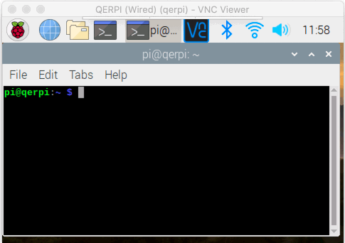     

## **Install four main python packages**  
Enter the following command in your terminal to install everything else that we need.

13. `sudo pip3 install packaging pyaccesspoint qrcode`
>**sudo** (super-user do) **pip3** (package manager for python) **install** (install the packages)  
>**packaging pyaccesspoint qrcode** (list of all packages separated by a space).   

- **packaging** • Core utilities for working with Python packages • https://github.com/pypa/packaging
- **pyaccesspoint** • Creates a wireless access point in python • https://github.com/Goblenus/pyaccesspoint
- **qrcode** • Generates QR codes • https://github.com/lincolnloop/python-qrcode
    
## **Install Feh picture Viewer**

14. `sudo apt install feh`
> **sudo** (super-user do) **apt** (Advanced Package Tool, the package manager for Debian) **fed** (the name of the package).
- **feh** • Fast, lightweight image viewer • https://github.com/derf/feh

## **Optional: Install Apache**
If you want to use a separate device, like an iPad or an Amazon Alexa to be able to display the QR code and WiFi information, then you need install a webserver. 

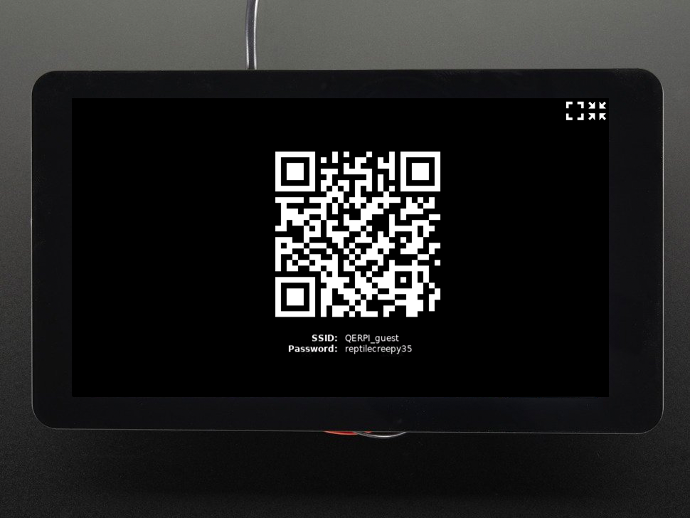

15. `sudo apt-get install apache2 -y`
> **sudo** (super-user do) **apt-get** (tells Advanced Package Tool (Debian package manager) to get most recent files)  
> **install** (install the packagse) **apache2** (Apache Web Server) **-y** (automatically select `Yes` to the prompts).
- **apache2** • Apache web server • https://git.apache.org/

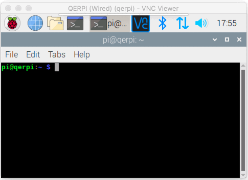

**Reboot**  

16. `sudo reboot`
> **sudo** (super-user do) **reboot** (restart)

## **Test Apache is running**
Apache is a web server that will be running on your Raspberry Pi. This takes information from people trying to access it through a web browser, and delivers it to them as a website.

17. From your Raspberry Pi, if you go to http://localhost/ you should see the Apache page load up. 
>This will only work if you enter the address on the Raspberry Pi.

18. From any computer on your network, if you go to http://qerpi.local/ the same webpage should load up.
>This will work from any computer attached to your network.

**If you see something like this, then it worked:**

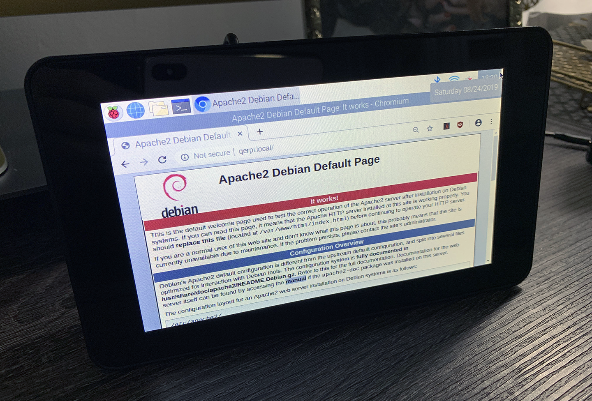

# **Download QERPI**
>This is the program that will create a new wireless network, allow people to connect to it, and generate a new random password along with a QR code every 24 hours. 

Open up terminal. You should be in your default directory.

1. `git clone https://github.com/yalefox/006-lets-build-qerpi.git qerpi` 
> **git** (popular version control program) **clone** (program within git to copy remote files)   
> **https://github.com/yalefox/006-lets-build-qerpi.git** (address of remote files for LCD drivers).
> **qerpi** (makes a new directory called qerpi and downloads the files there).

Next, navigate to the QERPI directory. 

2. `cd qerpi`
> **cd** (change directory) **qerpi** (directory to change to).

Next, run the python script to create the wireless network.

3. `sudo python3 ap.py`
> **cd** (change directory) **LCD-Show** (directory to change to).

If you want, you can [click here](./ap.py) to see what the Python script looks like.

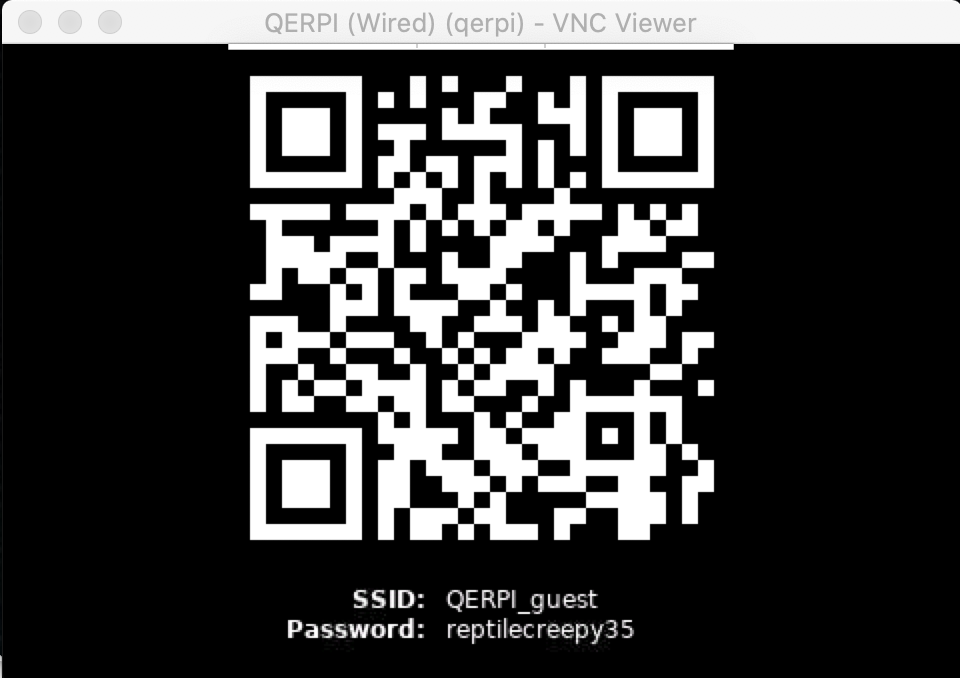

QERPI has now created it's own guest network called `QERPI_guest` and a random password, `reptilecreepy35`.   
If you scan the QR code with an iPhone or Android phone, it will prompt you to log in to the wifi:

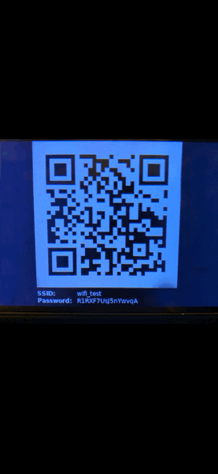 &nbsp;&nbsp; 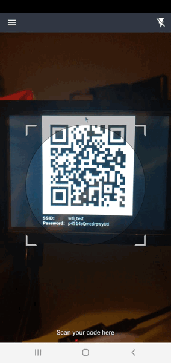

The password and QR code will change every **5 minutes** by default. Let's change it to every *24 hours*. At this point, you'll be able to rename your guest network to whatever you like.

## **Set the Wireless network name, and refresh rate**

Type in:

4. 'sudo nano ap.py'
> **sudo** (super-user do) **nano** (a text editor that works in terminal) **ap.py** (the name of the Python file).
  
Scroll down to roughly **line 35**, where you will see the **SSID** name.   
**SSID** is the **"Service Set IDentifier"** which is the name of the wireless network that will be broadcast.

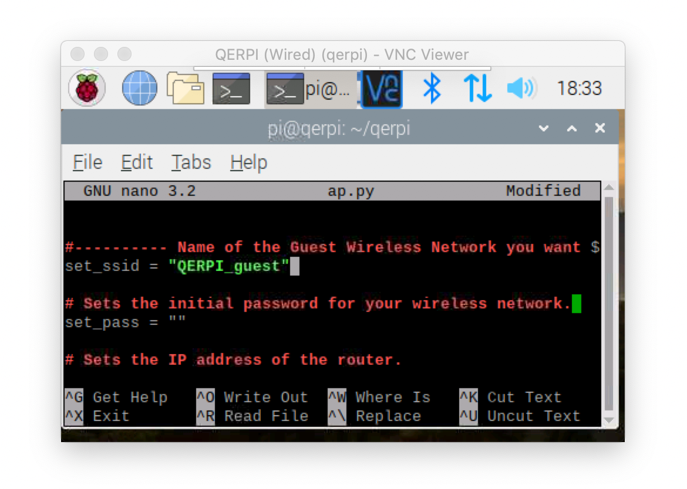

Scroll down to **line 63** where you will see the *time_QR_gen = 300*. This means a new WiFI password and QR code will be generated every 300 seconds (or 5 minutes).  

Let's change it to 24 hours by changing the value to **86400** _(24 hours * 60 minutes * 60 seconds)_
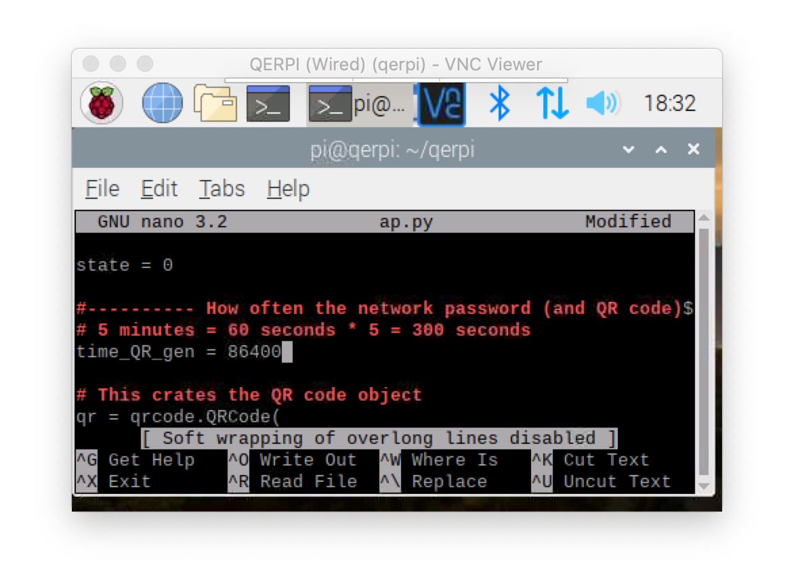  
Now save and exit:

5. `Command ⌘ + O` and then `Y` to save and exit. 

## Tell QERPI to start automatically when the computer boots up
Running QERPI requires running a Python script. In order to do that, we're going to use a **Shell Script**.
Click [here](./run_wifi.sh) to see the **Shell Script** and how it works.

Open up your terminal and **navigate to the QERPI directory**.
Next, we have to make the shell script executable.

6. `sudo chmod +x run_wifi.sh`
> **sudo** (super-user do) **chmod** (system command to change the file permissions) **+x** (makes it executable) **run_wifi.sh** (the name of the script).

Next, we need to open the Raspberry Pi's autostart file.

In a new terminal window type.

7. `sudo nano /etc/xdg/lxsession/LXDE-pi/autostart`
> **sudo** (super-user do) **nano** (a text editor that works in terminal) **etc/xdg/lxsession/LXDE-pi/autostart** (the name of system's autostart file).

Add the following line of text to the bottom of it.

8. `/home/pi/qerpi/run_wifi.sh`
> Now, when the Raspberry Pi loads up, it will run this script.

Save and exit.

9. `Command ⌘ + O` and then `Y` to save and exit. 

Reboot.

10. Disable the screensaver by editing the `lightDM.conf` configuration file
> LightDM is the name of the Display Manager Raspian uses. It's what shows you your desktop.

    - Type in `sudo nano /etc/lightdm/lightdm.conf`
    - find #xserver command# around line 45

2. Look for something called `Seat configuration` and below that a line that says `x`
    - remove this line (line 45) `# xserver-command = X server command to run (can also contain arguments e.g. X -special-option)` and replace it with `replace with xserver-command = X -s 0 -dpms
> This will disable the screensaver on your Raspberry Pi

10. `sudo reboot`

When the Pi boots up next, after a few seconds the Python program will automatically run.
If you want to disable autorun, you can either delete the line we added to the autostart file, or just rename `"run_wifi.sh"`to something else.

_You'll need to press **Escape** to exit_

## Have a second screen display the Guest Wifi
Earlier on, we installed the Apache web server. Currently, people can enter the url **http://qerpi.local/** and the server will send them HTML files so their web browser can display them. The program *ap.py* needs to create new files (like images of QR codes) and save them to the right directory within the web server.

After you install Apache, a directory called */var/www/html/* was created. This stores all the web files, but it's owned by the `root` user by default. We need to change it so that the user `pi` is able to write to it.

1. `sudo chown -R pi:www-data /var/www/html/`
>**sudo** (super-user do)  **chmod** (system command to change the owner) **-R** (recursively) **pi:www-data** (make the user _pi_ able to write anything to the group _www-data_ (the Apache group that can edit web files) **/var/www/html/** (the location of the directory or files to change permissions for). 

2. `sudo chmod -R 770 /var/www/html/`
>**sudo** (super-user do)  **chmod** (system command to change the owner) **-R** (recursively) **770** (Code to give the User and Group ability to read, write and execute) **/var/www/html/** (the directory where the web files are kept).

Now, navigate to the Apache main html directory. This is what page loads when you visit it in a browser.

3. `cd /var/www/html`
>**cd** (change directory) **/var/www/html/** (the directory to change to).

Rename the file from index.html to index2.html

4. `mv index.html index2.html`
> **mv** (move/rename) **index.html** (the file you want to move or rename) **index2.html** (where you want to move/rename it to).   

It's a bit strange, but the way linux renames a file is by moving it from one name to another.
If you want, you can navigate to the directory where `QERPI` was installed _(/home/pi/qerpi)_.

You'll see a list of files (described below) that will be used to create the webpage:
**Webpages**
These are in HTML/CSS and describe what a page looks like.
- [index.html](/secondscreen_files/index.html) • The main webpage that Apache will load

**JavaScript**
This is a scripting language that tells a webpage how to act. 
We use *jQuery* for our JavaScript.

- [jquery-3.1.1.min.js](/secondscreen_files/jquery-3.1.1.min.js) • This is the main *jQuery* framework. 
- [jquery.fullscreen.js](/secondscreen_files/jquery.fullscreen.js) • This is a script we use to maximize and minimize the web browser.

**Images**
- [black_fullscreen.png](/secondscreen_files/black_fullscreen.png) • Maximize to fullscreen image in BLACK.
- [black_exit_fullscreen.png](/secondscreen_files/black_exit_fullscreen.png) • Exit to fullscreen image in BLACK.

- [white_fullscreen.png](/secondscreen_files/white_fullscreen.png) • Exit from fullscreen image in WHITE.
- [white_exit_fullscreen.png](/secondscreen_files/white_exit_fullscreen.png) • Exit from fullscreen image in WHITE.

- [qerpi_icon.png](/secondscreen_files/qerpi-icon.png) • This is the icon we use for our Alexa Skill (covered later).

Lastly, lets move those files over to the web folder.

5. `mv /home/pi/qerpi/secondscreen_files/* /var/www/html/` 
> **mv** (move) **/home/pi/qerpi/secondscreen_files/*** (the * means _all_ files from this directory) */var/www/html/* (destionation directory).

Reboot one last time

6. `sudo reboot`

                                         ////// Done! //////

# Speed Benchmarking
We ran some tests to see how fast the internet was. To do this, we ran a number of speed tests where we wanted to see how long it took us to download a file **from the internet**. This was done on my home network (Gigabit speed, 1000 Mbit/s) and on the Raspberry Pi 3 B+ and Raspberry PI 4

1. **TEST 1:** was run directly from my router. This is a good test to see the maximum speed of your internet.
>It tested at 936.41 Mbit/s down, with 41.51 Mbit/s up.

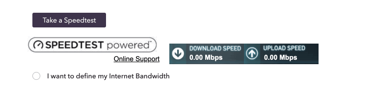

2. **TEST 2:** was run directly from my iMac. So that's connected via WiFi (802.11ac). 
>It tested at 150.02 Mbit/s down, with 32.57 Mbit/s up.

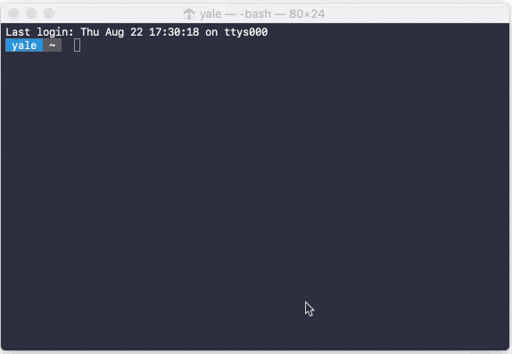

3. **TEST 3:** was run from the Raspberry Pi 3 B+ which was connected directly to the router.
>It tested at 93.16 Mbit/s down, with 37.49 Mbit/s up.

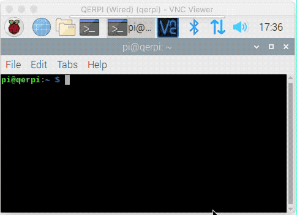

4. **TEST 4:** was run from the Raspberry Pi 4 which was connected directly to the router.
>It tested at 658.57 Mbit/s down, with 40.04 Mbit/s up.

The connection goes through a series of different physical wires, and will only be as fast as it's slowest connection. The Raspberry Pi 3 B+ has an ethernet port that goes through the USB bus, compared to the Raspberry Pi 4 which has dedicated Gigabit and is way faster. You can see what happens to the speed in the results.

If possible, you should **definitely** try to use your QERPI on a Raspberry Pi 4.

