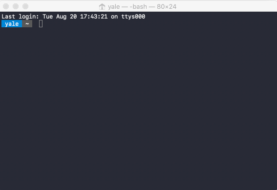

# Raspi-Config

1. Change User Password
    - The default password is `raspberry`. Change it to something different, that you won't forget.
2. Network Options
    - **N1: Hostname** Change the hostname to something you'll remember, like `raspie`
    - **N2: Wi-fi** You don't have to do anything here, you're already connected
    - **N3: Network interface names**
3. Boot Options
    - **B1: Desktop / CLI**
    - **B2: Wait for Network at Boot**
    - **B3: Splash Screen**
4. Localisation Options
    - **I1: Change Locale**
    - **I2: Change Timezone**
    - **I3: Change Keyboard Layout**
    - **I4: Change Wi-fi Country**
5. Interfacing Options (VNC, SPI, SSH alerady enabled)
    - **P1: Camera**
    - **P2: SSH**
    - **P3: VNC**
    - **P4: SPI**
    - **P5: I2C**
    - **P6: Serial**
    - **P7: 1-Wire**
    - **P8: Remote GPIO**
6. Overclock
    - With the Raspberry Pi 1 and 2 you used to be able to overclock them. It's here because they share the same image.
7. Advanced Options
    - **A1: Expand Filesystem**
    - **A2: Overscan**
    - **A3: Memory Split**
    - **A4: Audio**
    - **A5: Resolution**
    - **A6: Pixel Doubling**
    - **A7: GL Driver**
    - **A8: Compositor**
    - **A9: Pi 4 Video Output**
8. Update
    - Pressing this will update your Pi. You can do it from the command prompt
9. About raspi-config

#  **Common Errors**
Below is a list of common errors you might get, and why, when you're setting up your Pi.

## SSH-Keygen error

If you try to `ssh pi@192.168.1.100` and you get the error below:

```
@@@@@@@@@@@@@@@@@@@@@@@@@@@@@@@@@@@@@@@@@@@@@@@@@@@@@@@@@@@
@    WARNING: REMOTE HOST IDENTIFICATION HAS CHANGED!     @
@@@@@@@@@@@@@@@@@@@@@@@@@@@@@@@@@@@@@@@@@@@@@@@@@@@@@@@@@@@
IT IS POSSIBLE THAT SOMEONE IS DOING SOMETHING NASTY!
Someone could be eavesdropping on you right now (man-in-the-middle attack)!
It is also possible that a host key has just been changed.
The fingerprint for the ECDSA key sent by the remote host is
SHA256:tHDjmhJQg4uLfLs+OA6FhgcvVY/UItZqhy+SmcGlQ6Y.
Please contact your system administrator.
Add correct host key in /Users/yale/.ssh/known_hosts to get rid of this message.
Offending ECDSA key in /Users/yale/.ssh/known_hosts:16
ECDSA host key for 192.168.1.100 has changed and you have requested strict checking.
Host key verification failed.
```

Then you need to type: `ssh-keygen -R 192.168.1.100`

```# Host 192.168.1.100 found: line 16
/Users/yale/.ssh/known_hosts updated.
Original contents retained as /Users/yale/.ssh/known_hosts.old
```

 